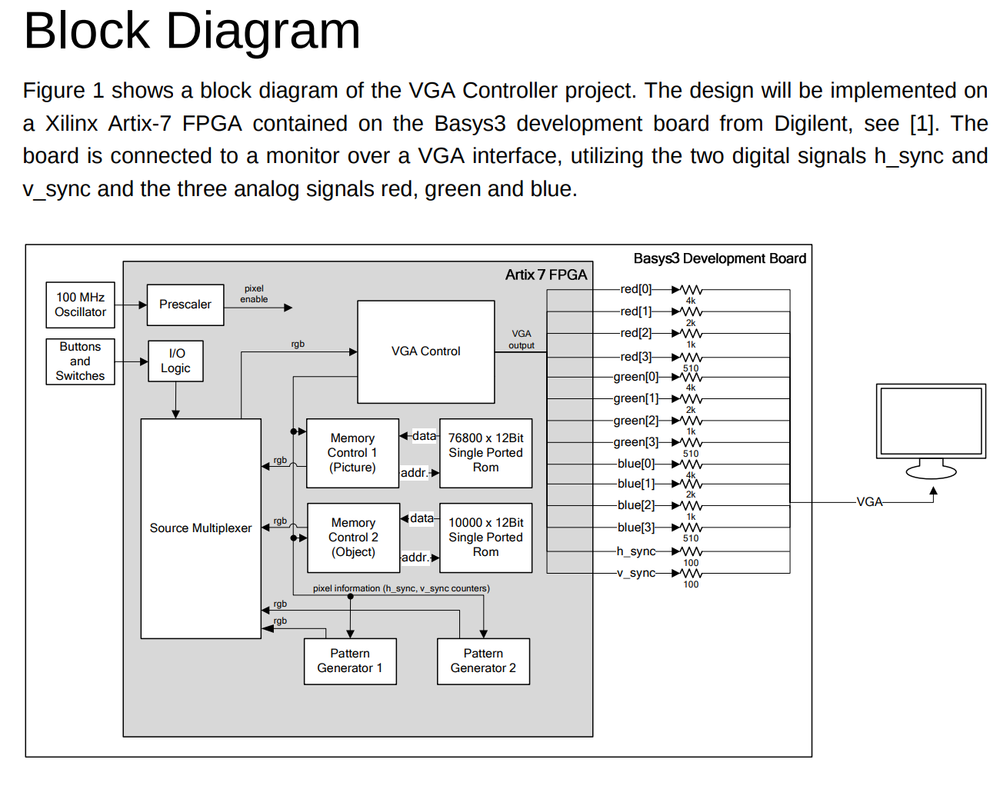
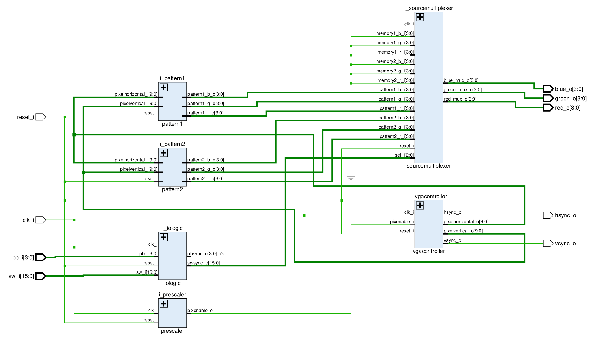
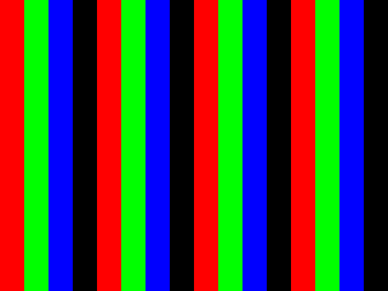
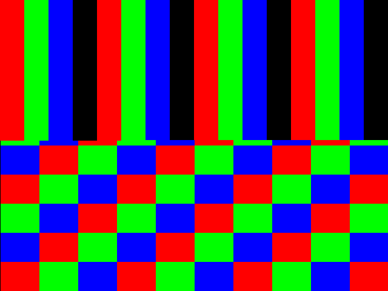
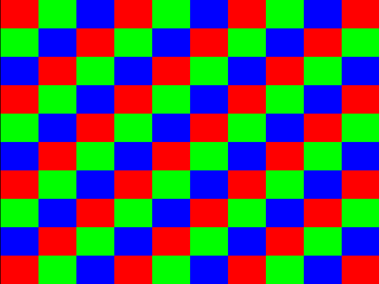
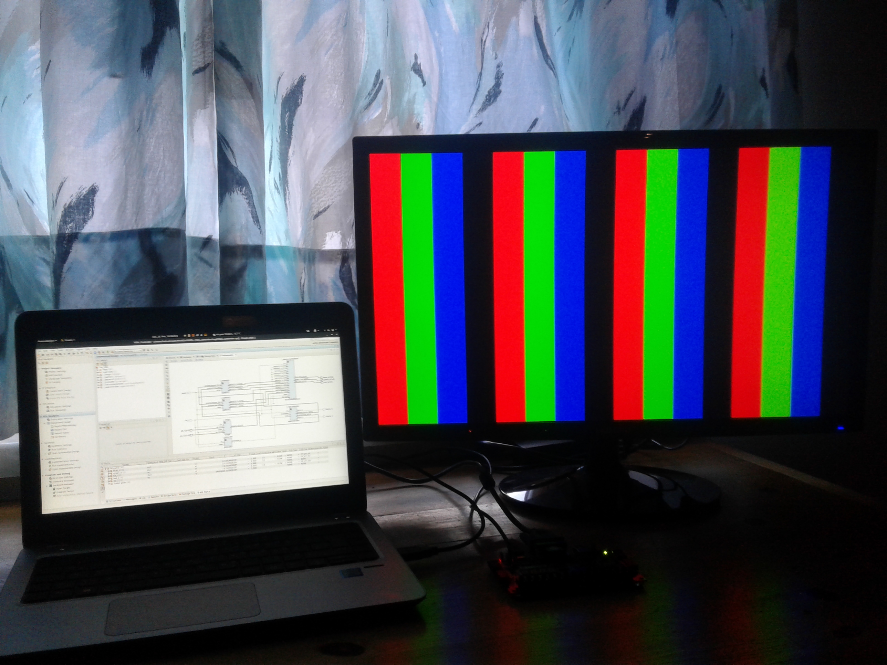
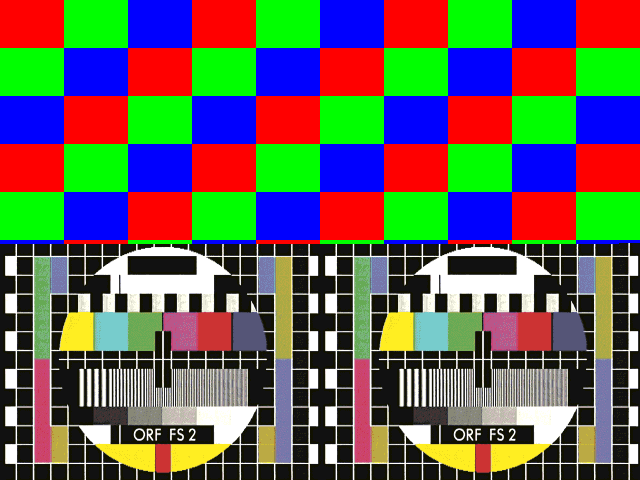
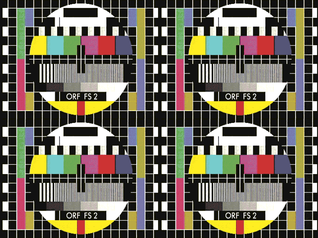

# CHD - BEL4 - VGA Controller

## misc. status reports

### the goal

| Description |
|--------------------|
|  |

### wordcount / linecount

Status 23.02.2018 23:00 Output is working

	~/WorkDir/VHDL_VGA_controller/vhdl helmutresch > wc *.vhd -l
	  116 iologic_rtl.vhd
	   34 iologic_.vhd
	  109 pattern1_rtl.vhd
	   37 pattern1_.vhd
	  145 pattern2_rtl.vhd
	   37 pattern2_.vhd
	   56 prescaler_rtl.vhd
	   31 prescaler_.vhd
	   75 sourcemultiplexer_rtl.vhd
	   47 sourcemultiplexer_.vhd
	  267 top_VGA_rtl.vhd
	   40 top_VGA_.vhd
	  121 vgacontroller_rtl.vhd
	   38 vgacontroller_.vhd
	 1153 insgesamt
	~/WorkDir/VHDL_VGA_controller/vhdl helmutresch > ^C
	~/WorkDir/VHDL_VGA_controller/vhdl helmutresch > cd ..
	~/WorkDir/VHDL_VGA_controller helmutresch > cd tb/
	~/WorkDir/VHDL_VGA_controller/tb helmutresch > wc *.vhd -l
	  104 tb_iologic_sim.vhd
	   24 tb_iologic_.vhd
	   73 tb_prescaler_sim.vhd
	   24 tb_prescaler_.vhd
	  275 tb_sourcemultiplexer_sim.vhd
	   25 tb_sourcemultiplexer_.vhd
	   94 tb_top_VGA_sim.vhd
	   27 tb_top_VGA_.vhd
	  105 tb_vgacontroller_sim.vhd
	   27 tb_vgacontroller_.vhd
	  778 insgesamt
	~/WorkDir/VHDL_VGA_controller/tb helmutresch > 

### schematic

[PDF Download VIVADO 22.02](doku/22.02.2018_schematic.pdf)

| Schematic |
|--------------------|
|  |

### code parts and latest revision

- 1% for documentation (code style check, comments, header)
- 10% for necessary adaption memory part for R 0 and R 1
- R = revision in header = used to divide project into units
- U = unit = steps in the project

| R | U | entity | v | date | % entity | architecture | % code | remark |
| -------- | ---- | ------ | ------- | ---- | -------- | ------------ | ------ | ------ |
| 0 | I/O | prescaler_ | 0.2 | 20.02 | 89% | prescaler_rtl | 89% | updates memory |
| 0 | I/O | iologic_ | 0.2 | 20.02 | 99% | iologic_rtl | 99% | - |
| 0 | I/O | sourcemultiplexer_ | 0.2 | 20.02 | 99% | sourcemultiplexer_rtl | 89% | overlay memory |
| 1 | VGA | vgacontroller_ | 0.3 | 22.02 | 99% | vgacontroller_rtl | 99% | - |
| 1 | VGA | pattern1_ | 0.3 | 22.02 | 99% | pattern1_rtl | 99% | - |
| 1 | VGA | pattern2_ | 0.3 | 22.02 | 99% | pattern2_rtl | 99% | done with loop |
| 1 | VGA | top_VGA_ | 0.3 | 22.02 | 99% | top_VGA_rtl | 99% | synthesized |
| 2 | MEM | memory1_ | 0.1 | 25.2 | 99% | memory1_rtl | 99% | working |
| 2 | MEM | memory2_ | - | - | 00% | memory2_rtl | 00% | start week 9 |

### output monitor FHTW

| pattern | 640x480 |
|-------- | ------- |
| pattern 1 |  |
| pattern 1+2 |   |
| pattern 2 |   |

### output VGA real monitor Samsung Vienna

https://www.youtube.com/watch?v=7fyMXrCMvPQ&feature=youtu.be

### output VGA real monitor Samsung Styria

| pattern | 640x480 |
|-------- | ------- |
| pattern 1 |  |
| pattern 2 |  |

### output monitor FHTW with testpicture from ROM

| pattern | 640x480 |
|-------- | ------- |
| pattern 2+3 |  |
| pattern 3 |   |

### output VGA real monitor Samsung Vienna with testpicture from ROM

https://www.youtube.com/watch?v=oO-Cmue0pPw
