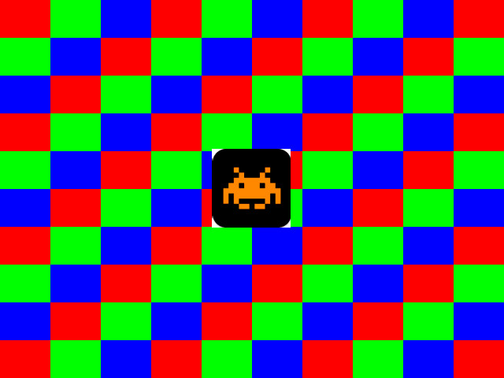

# CHD - BEL4 - VGA Controller - Helmut Resch

## the task

| Description                           |
| ------------------------------------- |
|  |

## the resulting task

All features according specification included and some extra features addes

Total 6 switches in use. 0 = off / 1 = on / X = don't care

| 05 | 04 | 03 | 02 | 01 | 00 | feature                               | basic | extra |
| -- | -- | -- | -- | -- | -- | ------------------------------------- | ----- | ----- |
| 0  | 0  | 0  | 0  | 0  | 0  | pattern1                              | yes   | -     |
| 0  | 0  | 0  | 0  | 1  | 0  | pattern2                              | yes   | -     |
| 0  | 0  | 0  | 0  | X  | 1  | memory1                               | yes   | -     |
| 0  | 0  | 0  | 1  | X  | X  | overlay spaceinvador                  | yes   | -     |
| 0  | 0  | 1  | 1  | X  | X  | overlay spaceinvador b/w transparency | -     | yes   |
| 0  | 1  | 1  | 1  | X  | X  | overlay spaceinvador orange only      | -     | yes   |
| 1  | X  | X  | X  | X  | X  | overlay spaceinvador automatic move   | -     | yes   |

The buttons to move the overlay spaceinvador are supported like in basic specification.
As extra feature it is possible to move the overlay spaceinvador over the "borders" to the opposite side.

In the automatic move mode it is possible to increase and decrease the spaceinvador's speed with the left/right button.

# code parts and latest revisions

## VHDL entities and architectures RTL + STRUC

| R   | U   | entity             | v   | date  | % entity | architecture rtl      | % code |
| --- | --- | ------------------ | --- | ----- | -------- | --------------------- | ------ |
| 0   | I/O | iologic_           | 0.7 | 01.05 | 100%     | iologic_rtl           | 100%   |
| 0   | I/O | prescaler_         | 0.7 | 01.05 | 100%     | prescaler_rtl         | 100%   |
| 0   | I/O | sourcemultiplexer_ | 0.7 | 01.05 | 100%     | sourcemultiplexer_rtl | 100%   |
| 1   | VGA | vgacontroller_     | 0.5 | 01.05 | 100%     | vgacontroller_rtl     | 100%   |
| 1   | VGA | pattern1_          | 0.5 | 01.05 | 100%     | pattern1_rtl          | 100%   |
| 1   | VGA | pattern2_          | 0.5 | 01.05 | 100%     | pattern2_rtl          | 100%   |
| 1   | VGA | top_VGA\_          | 0.5 | 01.05 | 100%     | top_VGA_rtl           | 100%   |
| 2   | MEM | memory1_           | 0.4 | 01.05 | 100%     | memory1_rtl           | 100%   |
| 2   | MEM | memory2_           | 0.4 | 01.05 | 100%     | memory2_rtl           | 100%   |

## VHDL TESTBENCH entities and architectures SIM

| R   | U   | entity                | v   | date  | % entity | architecture sim         | % code |
| --- | --- | --------------------- | --- | ----- | -------- | ------------------------ | ------ |
| 0   | I/O | tb_iologic_           | 0.2 | 01.05 | 100%     | tb_iologic_sim           | 100%   |
| 0   | I/O | tb_prescaler_         | 0.2 | 01.05 | 100%     | tb_prescaler_sim         | 100%   |
| 0   | I/O | tb_sourcemultiplexer_ | 0.2 | 01.05 | 100%     | tb_sourcemultiplexer_sim | 100%   |
| 1   | VGA | tb_vgacontroller_     | 0.2 | 01.05 | 100%     | tb_vgacontroller_sim     | 100%   |
| 1   | VGA | tb_pattern1_          | 0.2 | 01.05 | 100%     | tb_pattern1_sim          | 100%   |
| 1   | VGA | tb_pattern2_          | 0.2 | 01.05 | 100%     | tb_pattern2_sim          | 100%   |
| 1   | VGA | tb_top_VGA_           | 0.2 | 01.05 | 100%     | tb_top_VGA_rtl           | 100%   |

The testbench for memory1 and memory are included in the top_VGA testbench!

# schematic drawings

## RTL level

[PDF Download](doku/rtl_analysis_schematic.pdf)

## NETLIST level

[PDF Download](doku/post_synthesis_schematic.pdf)  

# timing memory1 and memory2

| timing   | memory                                       |
| -------- | -------------------------------------------- |
| memory 1 |  |
| memory 2 |  |

The "adress_in to data_out"-time is according the simulation model for both ROMs 20ns.

# Screenshot Vivado Utilization and Timing

| Vivado                                               |
| ---------------------------------------------------- |
|  |

[PNG Download](doku/vivado.png)  

All user specified timing constraints are met.

# errors

| description           | amount       |
| --------------------- | ------------ |
| Synthesis ROM related | 204          |
| Synthesis not used    | 27           |
| TOTAL                 | 231 warnings |

The not used connections / ports are due to optimization by VIVADO.

## Vivado Commands

	refresh_hw_device -update_hw_probes false [lindex [get_hw_devices] 0]

	[Labtools 27-3123] The debug hub core was not detected at User Scan Chain 1 or 3.
	Resolution: 
	1. Make sure the clock connected to the debug hub (dbg_hub) core is a free running clock and is active OR
	2. Manually launch hw_server with -e "set xsdb-user-bscan <C_USER_SCAN_CHAIN scan_chain_number>" to detect the debug hub at User Scan Chain of 2 or 4. To determine the user scan chain setting, open the implemented design and use: get_property C_USER_SCAN_CHAIN [get_debug_cores dbg_hub].

	refresh_hw_device [lindex [get_hw_devices] 0]

	[Labtools 27-3123] The debug hub core was not detected at User Scan Chain 1 or 3.
	Resolution: 
	1. Make sure the clock connected to the debug hub (dbg_hub) core is a free running clock and is active OR
	2. Manually launch hw_server with -e "set xsdb-user-bscan <C_USER_SCAN_CHAIN scan_chain_number>" to detect the debug hub at User Scan Chain of 2 or 4. To determine the user scan chain setting, open the implemented design and use: get_property C_USER_SCAN_CHAIN [get_debug_cores dbg_hub].

## Synthesis

### ROM related

	Out-of-Context Module Runs
	rom1_synth_1
	[Synth 8-3331] design blk_mem_gen_mux__parameterized0 has unconnected port MUX_RST[0]

	rom2_synth_1
	[Synth 8-3331] design blk_mem_gen_mux__parameterized0 has unconnected port MUX_RST[0]

	synth_1
	[Project 1-486] Could not resolve non-primitive black box cell 'rom1' instantiated as 'i_rom1' ["/home/helmutresch/WorkDir/VHDL_VGA_controller/vhdl/top_VGA_rtl.vhd":266]

	[Project 1-486] Could not resolve non-primitive black box cell 'rom2' instantiated as 'i_rom2' ["/home/helmutresch/WorkDir/VHDL_VGA_controller/vhdl/top_VGA_rtl.vhd":276]

	[Timing 38-316] Clock period '20.000' specified during out-of-context synthesis of instance 'i_rom1' at clock pin 'clka' is different from the actual clock period '10.000', this can result in different synthesis results.

	[Timing 38-316] Clock period '20.000' specified during out-of-context synthesis of instance 'i_rom2' at clock pin 'clka' is different from the actual clock period '10.000', this can result in different synthesis results.

### not used and optimized by Vivado

	[Synth 8-3332] Sequential element (i_pattern1/pattern1_r_o_reg[2]) is unused and will be removed from module top_VGA.

	[Synth 8-3332] Sequential element (i_pattern1/pattern1_r_o_reg[1]) is unused and will be removed from module top_VGA.

	[Synth 8-3332] Sequential element (i_pattern1/pattern1_r_o_reg[0]) is unused and will be removed from module top_VGA.

	[Synth 8-3332] Sequential element (i_pattern1/pattern1_g_o_reg[2]) is unused and will be removed from module top_VGA.

	[Synth 8-3332] Sequential element (i_pattern1/pattern1_g_o_reg[1]) is unused and will be removed from module top_VGA.

	[Synth 8-3332] Sequential element (i_pattern1/pattern1_g_o_reg[0]) is unused and will be removed from module top_VGA.

	[Synth 8-3332] Sequential element (i_pattern1/pattern1_b_o_reg[2]) is unused and will be removed from module top_VGA.

	[Synth 8-3332] Sequential element (i_pattern1/pattern1_b_o_reg[1]) is unused and will be removed from module top_VGA.

	[Synth 8-3332] Sequential element (i_pattern1/pattern1_b_o_reg[0]) is unused and will be removed from module top_VGA.

	[Synth 8-3332] Sequential element (i_pattern2/pattern2_r_o_reg[2]) is unused and will be removed from module top_VGA.

	[Synth 8-3332] Sequential element (i_pattern2/pattern2_r_o_reg[1]) is unused and will be removed from module top_VGA.

	[Synth 8-3332] Sequential element (i_pattern2/pattern2_r_o_reg[0]) is unused and will be removed from module top_VGA.

	[Synth 8-3332] Sequential element (i_pattern2/pattern2_g_o_reg[2]) is unused and will be removed from module top_VGA.

	[Synth 8-3332] Sequential element (i_pattern2/pattern2_g_o_reg[1]) is unused and will be removed from module top_VGA.

	[Synth 8-3332] Sequential element (i_pattern2/pattern2_g_o_reg[0]) is unused and will be removed from module top_VGA.

	[Synth 8-3332] Sequential element (i_pattern2/pattern2_b_o_reg[2]) is unused and will be removed from module top_VGA.

	[Synth 8-3332] Sequential element (i_pattern2/pattern2_b_o_reg[1]) is unused and will be removed from module top_VGA.

	[Synth 8-3332] Sequential element (i_pattern2/pattern2_b_o_reg[0]) is unused and will be removed from module top_VGA.

	[Synth 8-3332] Sequential element (i_sourcemultiplexer/s_y_reg[0]) is unused and will be removed from module top_VGA.

	[Synth 8-3332] Sequential element (i_sourcemultiplexer/s_position_vertical1_reg[0]) is unused and will be removed from module top_VGA.

	[Synth 8-3332] Sequential element (i_sourcemultiplexer/s_position_vertical2_reg[0]) is unused and will be removed from module top_VGA.

	[Synth 8-3332] Sequential element (i_sourcemultiplexer/v_tempspeed_reg[2]) is unused and will be removed from module top_VGA.

	[Synth 8-3332] Sequential element (i_sourcemultiplexer/v_tempspeed_reg[1]) is unused and will be removed from module top_VGA.

	[Synth 8-3332] Sequential element (i_sourcemultiplexer/v_tempspeed_reg[0]) is unused and will be removed from module top_VGA.

	[Synth 8-3332] Sequential element (i_sourcemultiplexer/s_speed_reg[2]) is unused and will be removed from module top_VGA.

	[Synth 8-3332] Sequential element (i_sourcemultiplexer/s_speed_reg[1]) is unused and will be removed from module top_VGA.

	[Synth 8-3332] Sequential element (i_sourcemultiplexer/s_speed_reg[0]) is unused and will be removed from module top_VGA.

# test output monitor FHTW

| pattern   | overlay | transparency | 640x480                                    |
| --------- | ------- | ------------ | ------------------------------------------ |
| pattern 1 | none    | none         |   |
| pattern 2 | none    | none         |   |
| memory 1  | none    | none         |   |
| pattern 1 | yes     | none         |   |
| pattern 2 | yes     | none         |   |
| memory 1  | yes     | none         |   |
| pattern 1 | yes     | b/w          |   |
| pattern 2 | yes     | b/w          |   |
| memory 1  | yes     | b/w          |   |
| pattern 1 | yes     | spaceinvador |   |
| pattern 2 | yes     | spaceinvador |  |
| memory 1  | yes     | spaceinvador |  |

# Conclusion

A challenging and interesting project!

# Improvements

- include mcp8051 uC and generate move patterns
